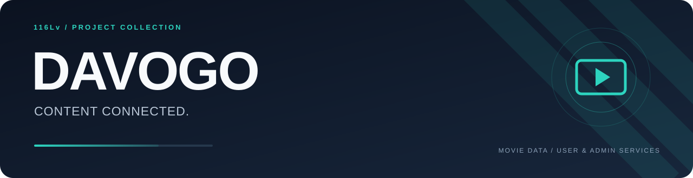
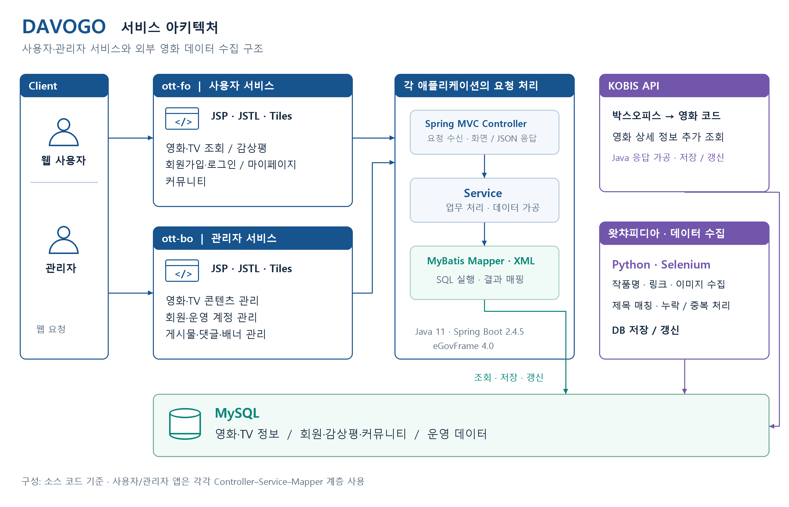

**영화와 콘텐츠 정보를 모아 제공하는 서비스**

DAVOGO는 영화·TV 콘텐츠를 탐색하고 감상평과 커뮤니티를 이용할 수 있는 서비스입니다. 사용자 서비스와 관리자 서비스를 나누어, 콘텐츠를 조회하는 흐름과 영화·회원·게시물을 관리하는 흐름을 함께 구성했습니다.

KOBIS의 박스오피스·영화 상세 정보와 왓챠피디아의 작품명·이미지·상세 링크를 수집하여 내부 영화 데이터에 연결했습니다. 외부 데이터 수집부터 저장, 사용자 조회와 관리자 운영까지 이어지는 프로젝트입니다.

## 담당 역할

**관리자·사용자 영역의 API 개발과 KOBIS 연동, 왓챠피디아 데이터 수집**에 참여했습니다. Java·Spring 기반의 요청 처리와 JSP 화면 구성을 다뤘으며, 외부 데이터를 요청하고 가공하여 내부 작품과 매칭한 뒤 DB에 저장·갱신하는 흐름을 구현했습니다.

## 서비스와 기술 구조

사용자용 `ott-fo`와 관리자용 `ott-bo`를 별도 애플리케이션으로 구성했습니다. 두 영역 모두 Spring MVC의 Controller → Service → MyBatis Mapper로 요청을 처리하며, SQL을 통해 MySQL 데이터를 조회·변경합니다. JSP·JSTL과 Tiles로 페이지를 구성하고, 일부 비동기 요청은 데이터 응답으로 처리합니다.

| 영역 | 구성과 역할 |
| --- | --- |
| 사용자 서비스 · ott-fo | 영화·TV 목록과 상세 조회, 회원가입·로그인, 감상평, 마이페이지와 커뮤니티 |
| 관리자 서비스 · ott-bo | 영화·TV 콘텐츠, 회원·운영 계정, 게시물·댓글·배너 관리 |
| 서버 | Java 11 · Spring Boot 2.4.5 · Spring MVC · 전자정부 표준프레임워크 4.0 기반 |
| 데이터 접근 | MyBatis Mapper와 XML SQL · MySQL |
| 화면 | JSP · JSTL · Apache Tiles를 통한 서버 측 페이지 구성 |
| 외부 연동·수집 | KOBIS API · Python · Selenium |
| 빌드·패키징 | Maven · WAR |

위 기능 목록은 저장소 전체 구성입니다. 개인 참여 범위는 담당 역할에 정리했습니다.

외부에서 수집한 결과는 내부 영화 정보와 연결해 저장하고, 서비스는 저장된 데이터를 조회합니다. 영화 코드로 연결할 수 있는 API 응답과 제목 비교가 필요한 크롤링 데이터를 구분하여 처리했습니다.

## 데이터가 연결되는 흐름

| 출처 | 가져오는 정보 | 내부 처리 |
| --- | --- | --- |
| KOBIS 일별 박스오피스 | 영화 코드와 목록 정보 | 각 영화의 상세 정보를 추가 조회 |
| KOBIS 영화 상세 | 영화 정보와 제작·배급사 | 영화 코드로 응답을 합치고 DB 저장·갱신 |
| 왓챠피디아 | 작품명, 상세 링크, 이미지 | 제목을 정리하여 내부 영화와 매칭 |

### KOBIS API 응답을 서비스 데이터로 가공했습니다

박스오피스 목록에서 영화 코드를 얻고, 해당 코드로 상세 정보를 추가 조회했습니다. 두 응답을 합친 뒤 제작사·배급사 등 필요한 정보를 가공하여 저장했습니다. 이미 등록된 영화인 경우 새로 만들지 않고 갱신하도록 처리했으며, 일별 수집 작업을 스케줄러와 연결했습니다.

### Selenium으로 웹 화면의 정보를 수집했습니다

왓챠피디아 페이지에서 XPath로 요소를 찾아 작품명·링크·이미지를 추출했습니다. API가 제공하는 응답 구조를 다루는 방식과 함께, 웹 화면의 요소를 기준으로 필요한 정보를 수집하는 방식도 경험했습니다.

### 수집 결과를 내부 영화와 연결했습니다

제목의 공백을 제거한 뒤 내부 영화 정보와 비교하여 외부 작품 정보를 연결했습니다. 매칭할 수 없는 작품은 건너뛰고, 이미지가 없는 경우와 중복 데이터가 들어온 경우를 나누어 처리했습니다.

외부 데이터는 수집에 성공하더라도 내부 데이터와 바로 일치하지 않을 수 있어, 표기를 정리하고 누락·중복을 처리하는 과정이 필요했습니다. 동명 작품이나 다른 표기의 제목은 개봉 연도 등 추가 속성을 비교하는 방식으로 보완할 수 있는 부분입니다.

## 저장소 구성

| 영역 | 구성 |
| --- | --- |
| 관리자 애플리케이션 | ott-bo · 운영 기능과 데이터 관리 |
| 사용자 애플리케이션 | ott-fo · 콘텐츠 조회와 사용자 기능 |
| 데이터 수집 | Python 기반 영화·TV 정보 수집 스크립트 |
| 데이터베이스 | MySQL 관련 자료 |
| 인프라 | AWS 관련 자료 |

이 README는 기존 프로젝트의 서비스 구조와 API 개발·외부 데이터 연동 경험을 정리한 소개 문서입니다.
